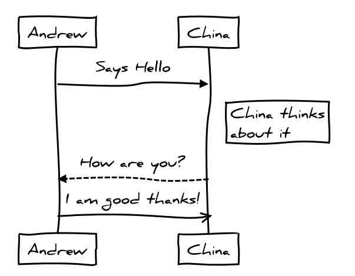

# gatsby-remark-graph

Make nice graphs in your markdown files in gatsbyjs, using [js-sequence-diagrams](https://bramp.github.io/js-sequence-diagrams/).

## install

`npm install --save gatsby-transformer-remark gatsby-remark-sequence`


## How to use

```js
// In your gatsby-config.js
plugins: [
  {
    resolve: 'gatsby-transformer-remark',
    options: {
      plugins: [
        {
          resolve: `gatsby-remark-sequence`,
          options: {
            // see more details on https://github.com/bramp/js-sequence-diagrams
            'theme': 'hand',
          }
        },
      ]
    }
  }
]
```

Make sure you put it before other plugins (especially those that work with `code` blocks, like [prism](https://www.gatsbyjs.org/packages/gatsby-remark-prismjs/).)

### Usage in Markdown

<pre>
```sequence
Andrew->China: Says Hello
Note right of China: China thinks\nabout it
China-->Andrew: How are you?
Andrew->>China: I am good thanks!
```
</pre>

Will give you a graph that looks like this:


